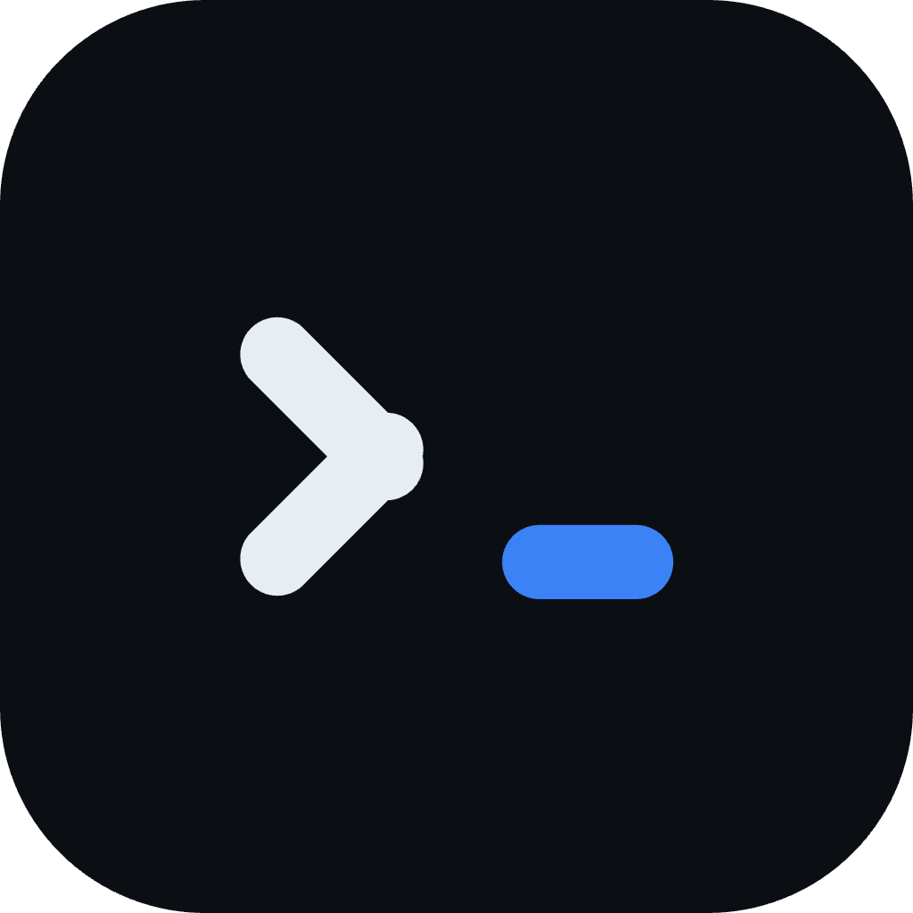
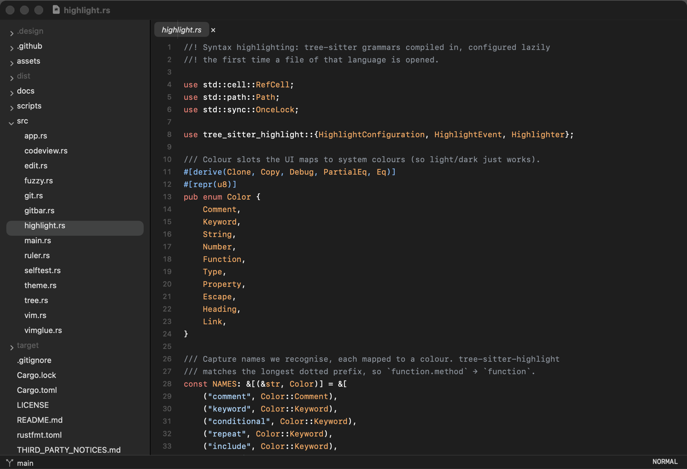

<p align="center">
  
</p>

<h1 align="center">Odek</h1>

<p align="center">
  A tiny, native macOS terminal for working alongside coding agents, with a
  built-in code viewer for when you need to look at the files.<br>
  Idles at ~22 MB.
</p>

<p align="center">
  <a href="https://github.com/HikvIneH/odek/actions/workflows/ci.yml"></a>
  <a href="LICENSE"></a>
  
  
  
</p>

> **Status:** the terminal is under active development (`odek --term`). It
> runs real shells and programs such as Claude Code, with grouped tabs, split
> panes and session restore. Next: opening files from the terminal in the code
> viewer. The code viewer itself is complete.

## Why

A day of work can mean several coding-agent sessions side by side, each in its
own terminal pane, plus an occasional look at the code. Modern GPU terminals
with built-in AI and cloud features can sit at several hundred megabytes and
grow into gigabytes after a long session. That hurts on an 8 GB laptop.

Odek does the same everyday job with the parts macOS already has: AppKit and
Core Text draw everything, so there is no GPU renderer, font engine or UI
framework of its own to keep in memory. Terminal cells take 8 bytes, styles are
stored once, and scrollback has a hard cap, so memory stays flat however much
output a session produces.

## Terminal

Working now:

- **Tabs grouped by project** in a sidebar: search, drag to reorder or move between groups, rename, collapse; each tab shows its folder and a status dot (green while a program runs, orange when one rang the bell or sent a notification you haven't seen)
- **Split panes**: side by side or stacked, as many as you like, with draggable dividers
- **Comes back as you left it**: groups, tabs, splits and each pane's folder are restored on relaunch (the shells start fresh)
- **Asks before ending work**: closing a pane, tab or the app asks first when a program such as Claude Code is still running
- **Runs anything**: your login shell, `vim`, `htop`, and coding agents such as Claude Code, with 24-bit colour, synchronized output (no flicker), bracketed paste, mouse reporting and focus events
- **Keys that agents expect**: Shift+Return for a newline, Shift+Tab, Option as Meta (Option+←/→ jump words), ⌘←/⌘→/⌘⌫ for line editing
- **Unicode**: wide CJK characters, emoji with skin tones and joined sequences, combining accents
- **Clean lines**: box-drawing and block characters are drawn as shapes, so borders and logos join without gaps in any font
- **Nerd Font icons**: uses MesloLGS NF (or another Nerd Font) when installed, so prompt themes like powerlevel10k show their icons
- **Scrollback** of 10,000 lines per shell (capped at 8 MB), selection by drag, double-click (word) and triple-click (line), copy and paste, ⌘K to clear
- **Find** in scrollback (⌘F), smart-case, with every match highlighted
- **Links**: ⌘-click URLs and file paths (`src/main.rs:42:7` too), including the hyperlinks Claude Code prints
- **Input methods**: the emoji picker, accents, and Chinese/Japanese/Korean input
- **Titles** from the running program (Claude Code shows its task there), the folder at a shell prompt; Dock bounce on bell or notification when Odek is in the background
- **Light and dark** themes that follow the system

Planned, in this order:

1. **Code viewer inside the window**: ⌘-click a file path to open it at the line, ⌘P in the current pane's folder, a file-explorer toggle
2. Reflowing text when a pane is resized, command blocks for plain shells, settings, themes

## Code viewer

The original Odek: a file tree and an editor, nothing else. No Electron, no
language servers, no extensions. It keeps VS Code's keyboard shortcuts and
habits, and has an optional Vim mode.

<p align="center">
  
</p>

- **File tree** that loads lazily; `.gitignore`d files shown dimmed, `.git` hidden
- **Preview tabs** like VS Code: single-click previews, double-click or typing keeps the tab
- **Quick open** (⌘P) with fuzzy matching that respects `.gitignore`
- **Syntax highlighting** with tree-sitter for Go, TypeScript/TSX, JavaScript/JSX, Rust, Swift, Python, SQL, LaTeX, Markdown, JSON, YAML, CSS, HTML and shell
- **Git status bar**: branch, commits to pull and push, uncommitted changes, background fetch, fast-forward pull
- **Vim mode** (optional): motions, operators, counts, visual mode, search, `:w` / `:q`
- **Editing basics**: line numbers, find and replace, go to line, toggle comment, auto-indent, word wrap
- **Picks up outside changes**: the tree and unmodified open files reload when you switch back to the app

## Performance

Measured on an M1 MacBook (8 GB). Memory is the process footprint, the number
Activity Monitor shows.

| Terminal | |
|---|---|
| One shell, idle | ~22 MB |
| Claude Code running in a 120×36 window | ~36 MB |
| 3 million lines printed (`seq 1 3000000`) | 3.1 s; settles back to ~35 MB |
| Full scrollback (10,000 lines) | ~2 MB of terminal data |

| Code viewer | |
|---|---|
| Project open, no file | ~22 MB |
| One file open | ~50 MB |
| Five files open | ~57 MB |
| Main window on screen after launch | ~140 ms |

The app is 19 MB on disk.

## Requirements

- macOS 12 or later (built and tested on Apple Silicon)
- Rust toolchain (`cargo`) to build from source
- `git` (the one that comes with Xcode Command Line Tools is fine) for the git status bar

## Installation

There are no prebuilt releases yet; build from source:

```sh
git clone https://github.com/HikvIneH/odek.git
cd odek
scripts/bundle.sh --install
```

This builds a release binary, wraps it in `Odek.app`, signs it ad hoc, and
installs:

- `~/Applications/Odek.app`
- `~/.local/bin/odek`, a small launcher script (make sure `~/.local/bin` is on your `PATH`)

`scripts/bundle.sh` without `--install` only builds `dist/Odek.app`.

While the terminal is in development, `scripts/install-term-preview.sh`
installs it as a separate app, `~/Applications/Odek Terminal Preview.app`,
that opens straight into the terminal and leaves `Odek.app` alone.

## Usage

```sh
odek --term             # terminal: restores your tabs
odek --term ~/code/app  # same, plus a new tab in that folder
odek .                  # code viewer on the current folder
odek src/main.go        # code viewer on a file; its folder becomes the project
```

Each `odek` call opens its own window and process, like `code .`.

The terminal font is the first one installed of MesloLGS NF and a few other
Nerd Fonts, otherwise SF Mono. To choose another:

```sh
defaults write com.hikvineh.odek terminalFont "JetBrains Mono"
```

### Terminal shortcuts

| Key | Action |
|---|---|
| ⌘T | New tab in the current folder and group |
| ⇧⌘N | New group |
| ⌘D / ⇧⌘D | Split right / split down |
| ⌘W / ⇧⌘W | Close pane / close tab |
| ⌘1 … ⌘8, ⌘9 | Go to tab 1 … 8, last tab |
| ⇧⌘] / ⇧⌘[ | Next / previous tab |
| ⌘] / ⌘[ | Next / previous pane |
| ⇧⌘R | Rename tab (empty name: follow the program's title) |
| ⌘B, ⇧⌘F | Toggle sidebar, search tabs |
| ⌘F, ⌘G / ⇧⌘G | Find in scrollback, next / previous match |
| ⌘C / ⌘V | Copy selection / paste |
| ⌘A | Select all, scrollback included |
| ⌘K | Clear scrollback |
| ⇧PageUp / ⇧PageDown, ⇧Home / ⇧End | Scroll back / forward, to top / bottom |
| ⌘← / ⌘→ / ⌘⌫ | Start of line / end of line / delete line |
| ⌥← / ⌥→ / ⌥⌫ | Word left / word right / delete word |
| ⇧Return | Newline without sending (Claude Code and similar) |
| ⌘= / ⌘- / ⌘0 | Font size |

### Code viewer shortcuts

| Key | Action |
|---|---|
| ⌘P | Quick open |
| ⌘O | Open folder |
| ⌘S / ⌘W | Save / close tab |
| ⌘F, ⌥⌘F | Find, replace |
| ⌘G, ⇧⌘G, ⌘E | Next match, previous match, use selection for find |
| ⌃G | Go to line (`42` or `42:7`) |
| ⌘/ | Toggle line comment |
| ⌘B | Toggle sidebar |
| ⌥Z | Toggle word wrap (on by default for Markdown and LaTeX) |
| ⌘= / ⌘- / ⌘0 | Font size |
| ⇧⌘] / ⇧⌘[, ⌃Tab / ⌃⇧Tab | Next / previous tab |
| ⌥⌘R | Reveal file in Finder |
| ⌥⌘V | Toggle Vim mode |

### Vim mode

Turn it on from **View ▸ Vim Mode** (⌥⌘V); the setting is remembered. The
status bar shows `NORMAL`, `-- INSERT --` or `-- VISUAL --`, and normal mode
uses a block cursor.

| Group | Keys |
|---|---|
| Motions | `h j k l`, `w b e`, `0 ^ $`, `gg G`, `{ }`, `%`, `f t F T ; ,`, Ctrl-d/u/f/b, counts (`5j`, `3w`) |
| Operators | `d c y > <` with any motion; `dd cc yy >> <<` |
| Editing | `x X D C Y s S`, `p P`, `r`, `J`, `~`, `u`, Ctrl-r |
| Insert | `i a I A o O`; Esc, Ctrl-[ or Ctrl-c to leave |
| Visual | `v`, `V`, then `d y c x > < J o` |
| Search | `/ ? n N * #` |
| Commands | `:w`, `:q`, `:q!`, `:wq`, `:x`, `:{line}` |
| Tabs, view | `gt` / `gT`, `zz zt zb` |

Yanks also go to the macOS clipboard, and `p` pastes text copied in other apps.
Not supported yet: `.` repeat, text objects (`iw`, `a(`), marks, macros and
registers other than the unnamed one.

### Git

The code viewer's status bar shows the current branch, like VS Code.
`main •  ↓2 ↑1` means uncommitted changes (`•`), 2 commits to pull (`↓`, shown
in orange) and 1 to push (`↑`).

- Odek runs `git fetch` in the background when a project opens and when you
  switch back to the app, at most every 5 minutes. Fetch never changes your
  files.
- Click the branch for **Fetch Now** and **Pull (fast-forward only)**. Pull
  refuses rather than merging when your branch has diverged, and asks you to
  save open edits first.

It runs the system `git`, so it adds nothing to the app's size or resident
memory.

## How it works

Terminal:

- **Parsing**: the [`vte`](https://crates.io/crates/vte) crate (the parser
  Alacritty uses) feeds Odek's own screen model.
- **8-byte cells**: each cell holds the character, a style index and flags.
  Colours and attributes are interned once per shell, and emoji sequences live
  in a small shared table.
- **Capped scrollback**: lines leaving the screen are trimmed of trailing
  blanks and kept up to 10,000 lines or 8 MB, whichever comes first.
- **Drawing**: AppKit string drawing (Core Text underneath) in a plain
  `NSView`, redrawing only the rows that changed. Font fallback for emoji and
  CJK comes from the system.
- **One pty per shell** with a reader thread and a writer thread, so a large
  paste never blocks the window. Updates are batched into one redraw per
  frame, and a synchronized update is shown only when it is complete.
- **No shell hooks**: the folder and program name of a shell come from the
  operating system (`proc_pidinfo`), not from scripts injected into your shell.
- **Workspace**: a small model of groups, tabs and split trees, saved as an
  indented text file in `~/Library/Application Support/Odek/workspace.txt`.
  Inactive tabs keep running but are taken out of the window, so they cost
  no drawing.

Code viewer:

- **Lazy tree**: a folder is read only when you expand it.
- **At most 8 tabs** stay in memory; opening a 9th closes the least recently
  used tab without unsaved changes.
- **Big files**: over 2 MB opens without highlighting; over 20 MB opens the
  first 5 MB read-only; binary files aren't loaded.
- **Highlighting**: tree-sitter grammars are compiled in, but each is set up
  only when a file of that language is first opened.
- **Text view**: TextKit 1 `NSTextView`, opted out of responsive scrolling so
  only the visible part of a document is rendered.

## Development

```sh
cargo test                       # unit tests: terminal, tree, fuzzy match, highlighting, git, Vim, edits
cargo run -- --term              # terminal, debug build
cargo run -- ~/some/project      # code viewer, debug build
```

Both parts can be driven off-screen, writing PNG snapshots and memory numbers,
so UI changes can be checked without screen recording:

```sh
cargo build --release --features selftest   # the self-tests are left out of normal builds

# terminal: one step per line (wait, keys, resize, snap, mem, quit, find, …)
scripts/termsnap.sh <out-dir> <start-dir> @steps.txt ['<command>']
# the workspace window instead, with its own throwaway save file
ODEK_TERM_WS=1 ODEK_WORKSPACE_FILE=/tmp/ws.txt scripts/termsnap.sh …

# code viewer
scripts/selftest.sh target/release/odek <project> <out-dir> <query> <file>...
```

For the code viewer self-test, extra environment variables:
`SELFTEST_NOSNAP=1` (measure memory without the snapshot bitmaps),
`SELFTEST_IDLE=12` (open files, then idle and sample), `SELFTEST_PIN=1`
(pinned tabs instead of preview), `SELFTEST_LIGHT=1`, and `SELFTEST_VIM='keys'`
(type Vim keys through real key events; `⎋` is Esc, `⏎` is Return).

The icon ("stanza": code lines set like verse) is drawn by
`assets/make-icon.swift`, with simpler artwork at 16 and 32 px;
`assets/make-icns.sh` rebuilds `assets/AppIcon.icns`.

### Project layout

```
src/main.rs          NSApplication setup; `--term` picks the terminal
src/term/vt.rs        terminal state machine (escape sequences → screen)
src/term/grid.rs      cells, interned styles, capped scrollback
src/term/session.rs   pty, shell process, reader and writer threads
src/term/view.rs      terminal NSView: drawing, keys, mouse, selection
src/term/input.rs     key, paste and mouse encoding
src/term/ime.rs       input methods (marked text, emoji picker)
src/term/find.rs      search in scrollback; findbar.rs is its UI
src/term/links.rs     URL and file path detection
src/term/boxdraw.rs   box-drawing and block characters as shapes
src/term/workspace.rs groups, tabs, split trees; save and restore
src/term/window.rs    workspace window: sidebar, panes, dialogs
src/term/sidebar.rs   grouped tab list; header.rs is the pane title strip
src/term/app.rs       app delegate, menus, scripted snapshot mode
src/app.rs           code viewer: window, tree, tabs, editor, quick open, menus
src/tree.rs          lazy file tree model
src/fuzzy.rs         file listing and nucleo ranking for ⌘P
src/highlight.rs     tree-sitter languages → coloured UTF-16 spans
src/theme.rs         GitHub light/dark palette as dynamic NSColors
src/ruler.rs         line-number gutter
src/codeview.rs      NSTextView subclass (block cursor, key routing)
src/edit.rs          pure text transforms (comment toggle, indent)
src/git.rs           branch, ahead/behind, fetch, pull via the git CLI
src/gitbar.rs        status-bar branch button and menu
src/vim.rs           Vim engine over an abstract buffer
src/vimglue.rs       NSTextView adapter for the Vim engine
src/selftest.rs      scripted code viewer test
```

## Contributing

Issues and pull requests are welcome. Before opening a PR:

1. Run `cargo fmt`, `cargo clippy --all-targets -- -D warnings` and `cargo test`
   (CI runs the same on macOS).
2. For UI changes, run `scripts/termsnap.sh` or `scripts/selftest.sh` and check
   the snapshots.
3. Keep the footprint in mind: a feature that adds resident memory or startup
   time needs a good reason, and the PR should say how much.

## License

[MIT](LICENSE). Third-party crates and their licenses are listed in
[THIRD_PARTY_NOTICES.md](THIRD_PARTY_NOTICES.md) (regenerate with
`python3 scripts/notices.py > THIRD_PARTY_NOTICES.md`).
