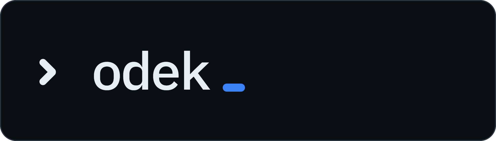
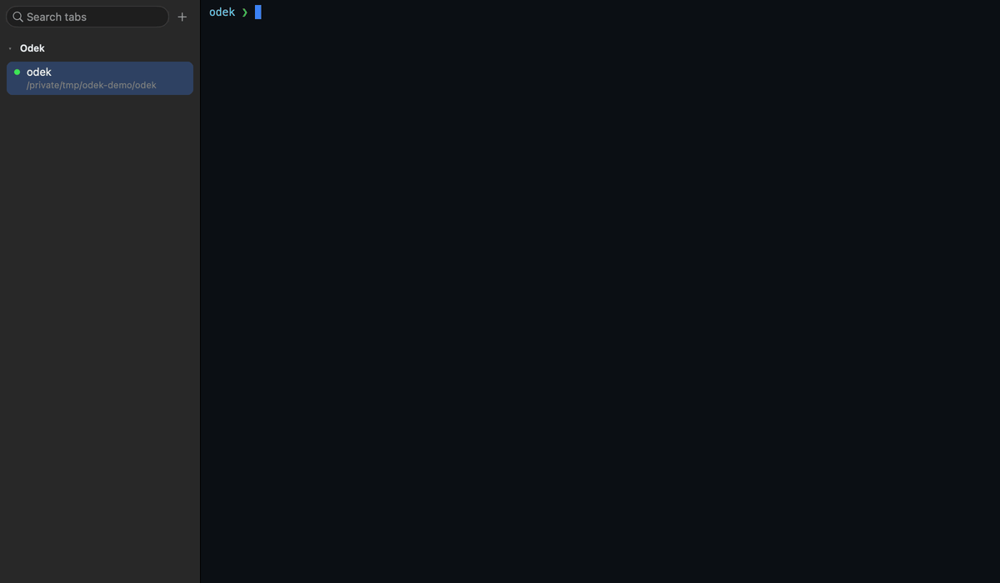
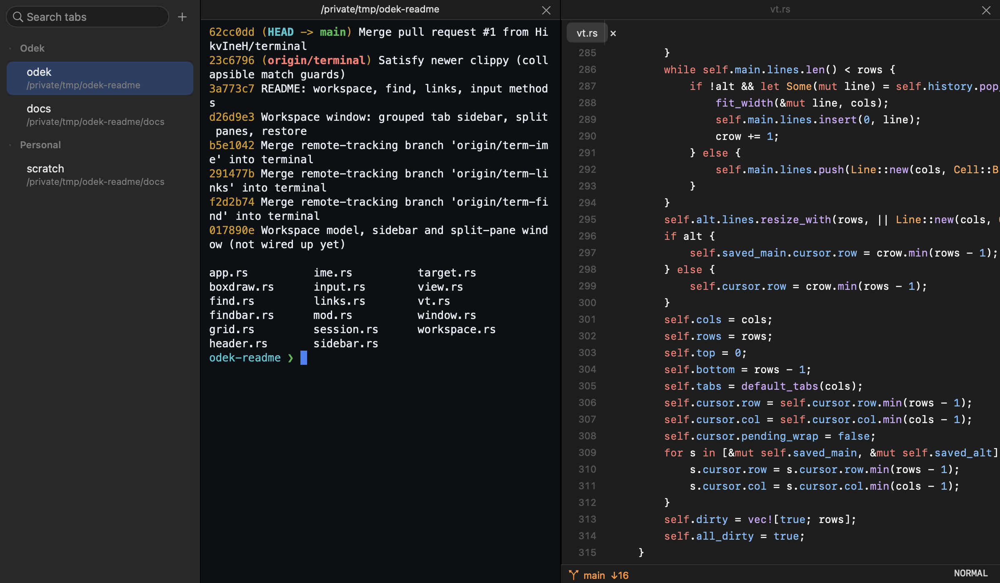

<p align="center">
  
</p>
<p align="center">A tiny, native terminal for macOS, made for running coding agents side by side.<br>
Grouped tabs, split panes and a built-in code viewer, native and light on memory.</p>

<p align="center">
  <a href="https://github.com/HikvIneH/odek/actions/workflows/ci.yml"></a>
  <a href="LICENSE"></a>
  
  
</p>

<p align="center">
  
</p>

<p align="center">Run something in a tab, open the file it points at beside it, start a long job in<br>
another tab and keep working: its dot shows while it runs and when it needs you.</p>

```sh
brew install --cask hikvineh/tap/odek
```

Apple Silicon, macOS 12 or later. More options under [Install](#install).

## Why

A working day can mean several coding agents running at once, each in its own
terminal, with a quick look at the code now and then. That calls for a terminal
that keeps them organised and stays out of the way, including on an 8 GB laptop
where memory is needed for builds and browsers.

odek does the everyday job with what macOS already has: AppKit and Core Text
draw every character, a terminal cell takes 8 bytes, and scrollback has a hard
cap. One idle shell uses about 38 MB and six busy panes about 70 MB; see
[Performance](docs/performance.md).

## Features

<p align="center">
  
</p>

**Workspace**

- Tabs grouped by project in a sidebar: search, drag between groups, rename, collapse
- A dot on each tab: green for the pane you're in, a ring while a program runs, orange when one needs you
- Split panes side by side or stacked, with draggable dividers
- Optional notifications when a background tab needs you; click to jump there
- Groups, tabs, splits and folders come back on relaunch
- Asks before closing anything with a running program or unsaved file

**Terminal**

- Runs your shell, `vim`, `htop` and coding agents such as Claude Code, in 24-bit colour without flicker
- The keys agents expect: Shift+Return, Shift+Tab, Option as Meta, ⌘←/⌘→/⌘⌫
- Text reflows on resize, scrollback included; 10,000 lines per pane
- Unicode done right: CJK, emoji sequences, input methods, Nerd Font icons
- ⌘-click URLs and `path:line:col`, find with every match highlighted
- Terminal.app's commands: ⌘L, ⌘↑/⌘↓ between commands, ⌘K to clear

**Code viewer**

- ⌘-click a path to open it at that line, ⌘P to search the project, ⇧⌘E for the tree
- Tree-sitter highlighting for Go, TypeScript, Rust, Swift, Python, LaTeX and more
- Light editing with VS Code's keys, plus an optional Vim mode
- Git branch, ahead/behind and fast-forward pull in the status bar
- Reloads files an agent rewrote; keeps at most 8 files in memory

## Install

odek runs on Apple Silicon Macs with macOS 12 or later. A
[Nerd Font](https://www.nerdfonts.com) such as MesloLGS NF is optional, for
prompt icons.

```sh
brew install --cask hikvineh/tap/odek
```

This installs `Odek.app` and the `odek` command. Update with
`brew upgrade --cask odek`.

odek isn't notarized by Apple yet, so the cask clears the download quarantine
flag for you. If you download the zip from
[Releases](https://github.com/HikvIneH/odek/releases) instead, macOS will refuse
to open it the first time: choose **Open Anyway** in System Settings › Privacy &
Security, or run `xattr -dr com.apple.quarantine /Applications/Odek.app`.

To build from source you need a Rust toolchain (`cargo`):

```sh
git clone https://github.com/HikvIneH/odek.git
cd odek
scripts/bundle.sh --install
```

This installs `~/Applications/Odek.app` and links `~/.local/bin/odek` (make sure
`~/.local/bin` is on your `PATH`).

## Usage

```sh
odek                    # open odek; your tabs come back
odek ~/code/app         # a new tab in that folder
odek src/main.rs        # the file in the code viewer
odek --viewer ~/code    # the code viewer in a window of its own
```

`odek` hands paths to the odek that's already running, so everything stays in
one window. You can also drop a folder or file on the Dock icon.

| Key | Action |
|---|---|
| ⌘T / ⌘O | New tab here / in a folder you pick |
| ⌘D / ⇧⌘D | Split right / split down |
| ⌘W / ⇧⌘W | Close pane / close tab |
| ⌘1 … ⌘9, ⌘] / ⌘[ | Go to a tab, next / previous pane |
| ⌘F | Find |
| ⌘P / ⇧⌘E | Quick open a file / file tree |
| ⌘, | Settings |
| ⌘/ | Every command and its keys |

All keys, Vim mode, the git status bar and settings: [docs/shortcuts.md](docs/shortcuts.md).

## Documentation

- [Keyboard shortcuts and settings](docs/shortcuts.md): every key for tabs, panes, the terminal and the code viewer, Vim mode, git and settings
- [Performance](docs/performance.md): what the memory numbers mean, the full table and how to reproduce it
- [Development](docs/development.md): building, testing, off-screen snapshots, how it works, project layout and contributing

## License

[MIT](LICENSE). Third-party crates and their licenses are listed in
[THIRD_PARTY_NOTICES.md](THIRD_PARTY_NOTICES.md).
